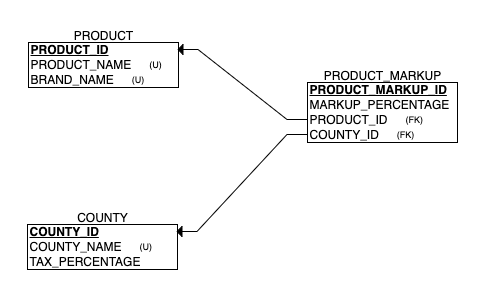

**Object Oriented Design:**

We have 3 class objects Product, County and Product Markup.

**Objects:**

- **Product**
  - **Product Name**
  - **Brand Name**
  - **Cost Price**
- **County**
  - **County Name**
  - **Tax Percentage**
- **Product Markup**
  - **Product**
  - **County**
  - **Mark Up Price**

**ER DIAGRAM:**

The following is an ER Diagram if we have to design a database schema for St. Bernard Corners.

- There will be 3 tables one for each of the objects – PRODUCT, COUNTY, PRODUCT\_MARKUP
- The PRODUCT table will have PRODUCT\_ID (PK), PRODUCT\_NAME and BRAND\_NAME
- The COUNTY table has COUNTY ID (PK), COUNTY\_NAME and TAX\_PERCENTAGE
- The PRODUCT\_MARKUP table has PRODUCT\_MARKUP ID (PK), MARKUP\_PERCENTAGE, PRODUCT\_ID (FK), COUNTY\_ID (FK)

<ins>Note:</ins> For the convenience of this code challenge, I included brand name as an attribute of product. For a more realistic approach, we can extract the brand name into a new table and include a foreign key in the product table

<ins>Assumptions:</ins> I have assumed the tax is being paid by the store on the selling price rather than the customer when calculating profit.